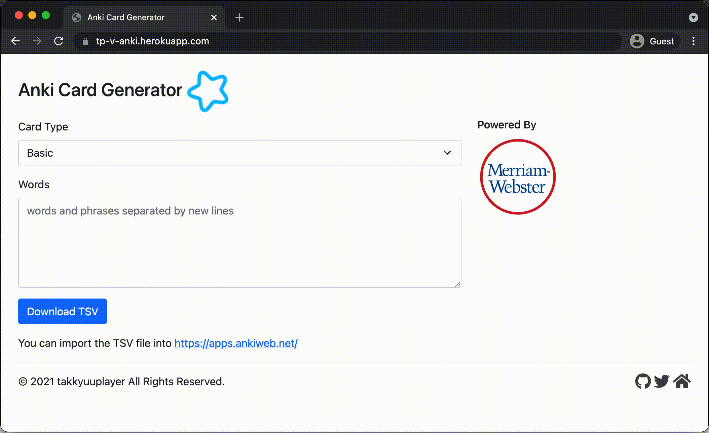

# v-anki


[](https://heroku.com/deploy)

Generate CSV to import into [Anki](https://apps.ankiweb.net/).

## Demo

https://tp-v-anki.herokuapp.com/



## Usage

### Prerequisite

1. Sign up [Merriam\-Webster Dictionary API](https://www.dictionaryapi.com/) and get a Learner's key and a Collegiate key.
2. `cp .env.sample .env`
3. Replace `.env` file's keys with your own ones.

### Web

```bash
source .env
v run main.v web
```

### CLI

#### basic card

```bash
source .env
cat words.txt | anki cli > anki.csv
```

#### example sentences card

```bash
cat words.txt | anki cli -card=sentences > anki.csv
```

## Supported Dictionaries

- Merriam-Webster
  - [Learners Dictionary API \| Merriam\-Webster Dictionary API](https://dictionaryapi.com/products/api-learners-dictionary)
  - [Collegiate Dictionary API \| Merriam\-Webster Dictionary API](https://dictionaryapi.com/products/api-collegiate-dictionary)
